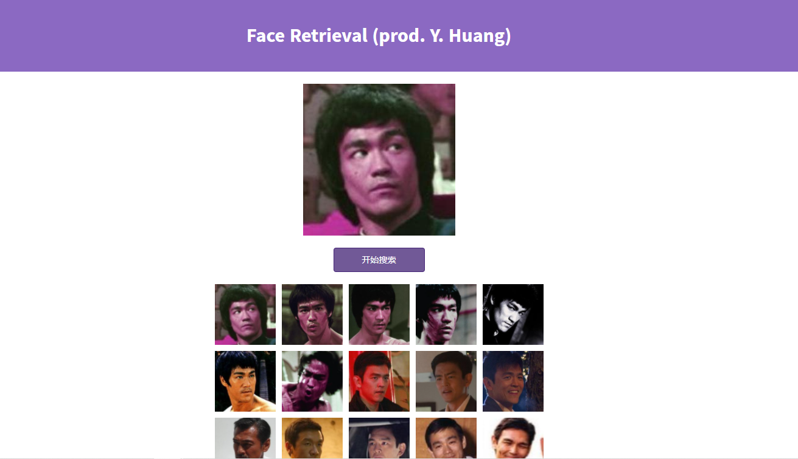
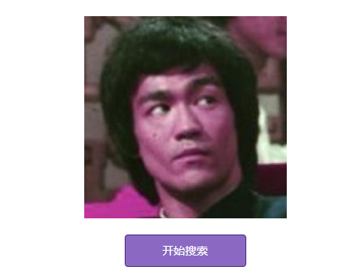

> 人脸数据集来源：CASIA WebFace

# 实现效果

我的照片：

小龙：

# 前端页面

**初始页面**

开始搜索按钮是不可用状态，当上传图片后，预览上传的图片，并且开始搜索按钮正常显示

实现：v-if + v-else.

将上传的图片名保存在data数据uploadList中，v-if的条件即为这个数组的长度。显示的时候根据计算属性计算出图片路径，给img绑定动态的:src显示。

**瀑布流布局**

原本以为数据集里人脸图片大小会差很多，所以用了瀑布流布局，效果是

没想到啊没想到，图片大小比较统一，瀑布流布局优势体现不出来，罢了罢了，权当练习。

原理：有一个高度数组存储每一列的高度，然后把图片放在目前高度数组中最矮的位置，并且更新这一列的高度。这个”放“的操作实际是计算图片绝对定位的top和left，然后把这些信息放在一个数组中，然后再v-for遍历去渲染

# 后端接口

获取
